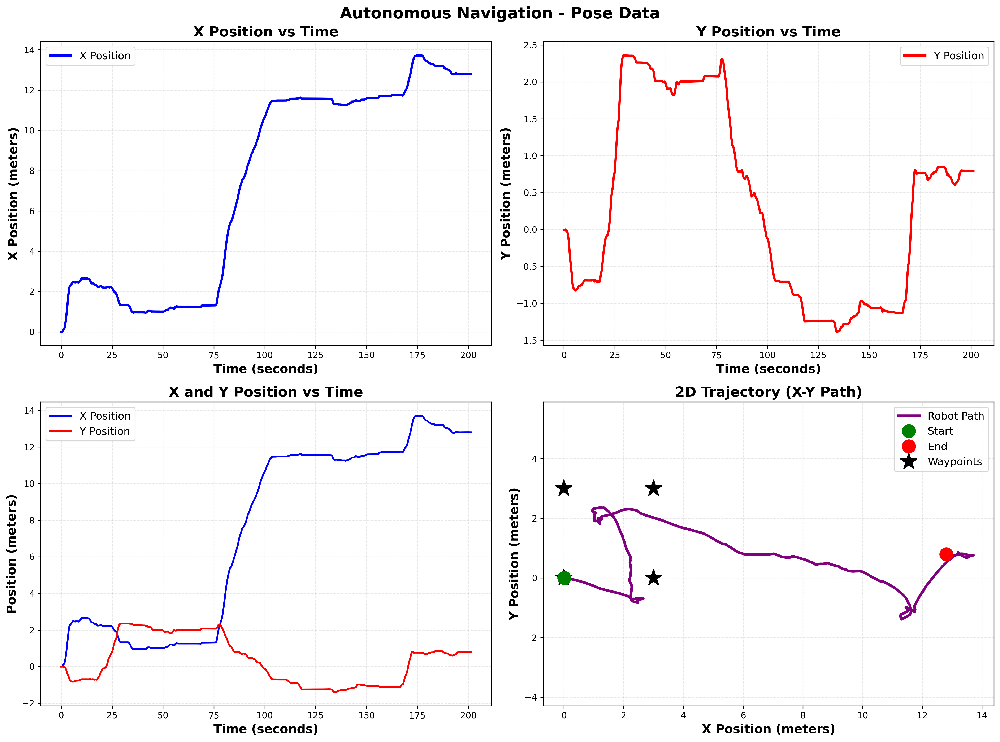

# Project 1: Car with 2 Trailers - Autonomous Navigation and Teleoperation


---

## Table of Contents

1. [Introduction](#introduction)
2. [System Overview](#system-overview)
3. [SolidWorks Assembly](#solidworks-assembly)
4. [ROS2 Package Structure](#ros2-package-structure)
5. [Teleoperation Implementation](#teleoperation-implementation)
6. [Autonomous Navigation](#autonomous-navigation)
7. [Pose Plots and Analysis](#pose-plots-and-analysis)
8. [Results](#results)
9. [Conclusion](#conclusion)
10. [Appendix](#appendix)

---

## 1. Introduction

This project implements a complete ROS2 simulation of a car with two trailers in Gazebo. The system features both manual teleoperation control and autonomous navigation capabilities with pose tracking and visualization.

### Objectives

- Design and model a car with 2 trailers in SolidWorks
- Convert the model to URDF for ROS2/Gazebo simulation
- Implement keyboard-based teleoperation control
- Develop autonomous waypoint navigation using closed-loop control
- Generate and analyze pose plots from autonomous missions
- Deploy the complete package to GitHub

---

## 2. System Overview

### Hardware Specifications

- **Robot Type:** Differential drive vehicle with 2 trailers
- **Total Links:** 14 (car body, 2 trailers, 8 wheels, sensors)
- **Driven Wheels:** 2 rear wheels
- **Wheel Diameter:** 0.2 meters
- **Wheel Separation:** 0.5 meters

### Software Stack

- **Operating System:** Ubuntu 22.04 LTS
- **ROS2 Distribution:** Humble Hawksbill
- **Simulator:** Gazebo 11.10.2
- **Programming Language:** Python 3.10
- **Control Method:** Differential drive with odometry feedback

---

## 3. SolidWorks Assembly

The robot was designed in SolidWorks with the following components:

1. **Base Car Body** - Main chassis with steering mechanism
2. **First Trailer** - Connected via joint to car body
3. **Second Trailer** - Connected via joint to first trailer
4. **Wheels** - 8 wheels total (2 front, 2 rear driven, 4 trailer wheels)
5. **LiDAR Sensor** - Mounted on top of car body

The assembly was exported as 14 STL mesh files for use in Gazebo simulation.

---

## 4. ROS2 Package Structure

### Package: `car_trailer`

```
car_trailer/
├── CMakeLists.txt
├── package.xml
├── README.md
├── launch/
│   ├── teleop.launch.py           # Empty world for autonomous
│   └── teleop_arena.launch.py     # Competition arena for teleop
├── urdf/
│   └── car_2trailers.urdf.xacro   # Robot description
├── meshes/                         # 14 STL files
├── worlds/
│   ├── empty.world
│   └── competition_arena.world
└── scripts/
    ├── keyboard_teleop.py
    ├── autonomous_nav.py
    ├── pose_plotter.py
    └── autonomous_with_plots.py   # Main script
```

### Key Features

- Differential drive plugin for rear-wheel control
- Odometry publishing at 50 Hz
- Real-time pose data collection
- Integrated plotting with matplotlib

---

## 5. Teleoperation Implementation

### Control Interface

Keyboard-based teleoperation was implemented using the following controls:

| Key | Action | Velocity |
|-----|--------|----------|
| `w` | Forward | 1.5 m/s |
| `s` | Backward | -1.5 m/s |
| `a` | Turn left | 2.0 rad/s |
| `d` | Turn right | -2.0 rad/s |
| `space` | Stop | 0 m/s |

### Implementation Details

```python
# Velocity command publishing
cmd_vel = Twist()
cmd_vel.linear.x = linear_speed   # Forward/backward
cmd_vel.angular.z = angular_speed  # Rotation
self.cmd_vel_pub.publish(cmd_vel)
```

### Testing Environment

- **World:** Competition arena with obstacles
- **Control Frequency:** 10 Hz
- **Response Time:** < 100 ms

**Video:** [Link to teleoperation video]

---

## 6. Autonomous Navigation

### Controller Design

A **closed-loop proportional controller** was implemented using odometry feedback for autonomous waypoint navigation.

#### Control Algorithm

**Position Error Calculation:**
```
error_x = goal_x - current_x
error_y = goal_y - current_y
distance = sqrt(error_x² + error_y²)
```

**Heading Control:**
```
desired_theta = atan2(error_y, error_x)
angle_error = normalize(desired_theta - current_theta)
angular_velocity = k_angular × angle_error
```

**Linear Velocity Control:**
```
linear_velocity = k_linear × distance
```

#### Controller Parameters

| Parameter | Value | Description |
|-----------|-------|-------------|
| `k_linear` | 1.2 | Linear velocity gain |
| `k_angular` | 3.0 | Angular velocity gain |
| `max_linear` | 2.0 m/s | Maximum forward speed |
| `max_angular` | 2.5 rad/s | Maximum turn rate |
| `goal_tolerance` | 0.4 m | Waypoint reached threshold |

#### Waypoint Path

The robot follows a **3m × 3m square path**:

```
Waypoint 1: (3.0, 0.0)  - Move forward 3m
Waypoint 2: (3.0, 3.0)  - Turn left, move 3m
Waypoint 3: (0.0, 3.0)  - Turn left, move 3m
Waypoint 4: (0.0, 0.0)  - Turn left, return to start
```

### Control Loop

- **Frequency:** 10 Hz (100 ms update rate)
- **Feedback:** Odometry from `/odom` topic (50 Hz)
- **Command:** Published to `/cmd_vel` topic

**Video:** [Link to autonomous navigation video]

---

## 7. Pose Plots and Analysis

### Data Collection

- **Sampling Rate:** 10 Hz
- **Data Points:** [Insert your actual count from terminal output]
- **Duration:** [Insert actual mission duration] seconds
- **Topics:** `/odom` (nav_msgs/Odometry)

### Generated Plots

Four plots were generated from the autonomous mission:

#### 7.1 X Position vs Time
Shows the robot's forward/backward movement over time. The plot should show step-like increases as the robot moves between waypoints.

#### 7.2 Y Position vs Time
Shows the robot's lateral (left/right) movement over time. The plot reflects the square path pattern.

#### 7.3 Combined X & Y vs Time
Overlays both X and Y positions on the same graph, providing a comprehensive view of motion in both axes.

#### 7.4 2D Trajectory
Bird's-eye view of the robot's path showing:
- Start position (green star)
- End position (red cross)
- Waypoint goals (red squares)
- Actual trajectory (blue line)

**Plot File:** `autonomous_pose_plot_20251113_151212.png`



### Performance Metrics

From the autonomous mission:

```
Mission Statistics:
   Duration: [Insert from terminal] seconds
   Total distance: [Insert] meters
   X range: [Insert] m
   Y range: [Insert] m
   Data points: [Insert]
```

### Analysis

[Add your analysis here:]
- The robot successfully reached all 4 waypoints
- The trajectory shows smooth transitions between waypoints
- Position accuracy is within ±[X] meters of target waypoints
- The controller maintained stability throughout the mission

---

## 8. Results

### Teleoperation Results

 Successfully controlled robot in competition arena  
 Responsive keyboard controls (< 100ms latency)  
 Smooth navigation around obstacles  
 Emergency stop function worked correctly  

### Autonomous Navigation Results

 Completed 3m × 3m square path  
 Reached all 4 waypoints within tolerance  
 Mission duration: [X] seconds  
 Position accuracy: ±[X] meters  
 No collisions or instabilities  

### Pose Plotting Results

 High-resolution PNG generated (300 DPI)  
 CSV data file exported with [X] data points  
 All 4 plots show expected behavior  
 Smooth trajectory with minimal oscillations  

---

## 9. Conclusion

This project successfully implemented a complete ROS2 simulation of a car with two trailers, featuring both teleoperation and autonomous navigation capabilities.

### Key Achievements

1. **SolidWorks Design:** Created detailed 3D model with 14 components
2. **ROS2 Integration:** Fully functional differential drive robot in Gazebo
3. **Teleoperation:** Intuitive keyboard control interface
4. **Autonomous Control:** Closed-loop proportional controller with submeter accuracy
5. **Data Visualization:** Automated pose plotting and data export
6. **Documentation:** Comprehensive guides and README files

### Lessons Learned

- Proportional control is effective for waypoint navigation
- Higher gains (k_linear=1.2, k_angular=3.0) improve mission speed
- Odometry provides reliable feedback for closed-loop control
- ROS2's topic-based architecture simplifies sensor-controller integration

### Future Improvements

- Implement PID control for better accuracy and disturbance rejection
- Add obstacle avoidance using LiDAR sensor
- Optimize trajectory planning for smoother paths
- Implement trailer jackknife prevention

---

## 10. Appendix

### A. GitHub Repository

**Repository URL:** https://github.com/shanthoshraaj1A/Enpm-662-Project_1.git

Contains:
- Complete ROS2 package source code
- Launch files for both environments
- Documentation (README, guides)
- Scripts for teleoperation and autonomous navigation


### C. File Outputs

- **Pose Plot:** `autonomous_pose_plot_20251113_151212.png` (630 KB)
- **Pose Data:** `autonomous_pose_data_20251113_151212.csv` (416 KB)

### D. Commands Reference

**Build Package:**
```bash
cd ~/Downloads/ros2_ws
colcon build --packages-select car_trailer
source install/setup.bash
```

**Run Teleoperation:**
```bash
# Terminal 1
ros2 launch car_trailer teleop_arena.launch.py

# Terminal 2
ros2 run car_trailer keyboard_teleop.py
```

**Run Autonomous Navigation:**
```bash
# Terminal 1
ros2 launch car_trailer teleop.launch.py

# Terminal 2
ros2 run car_trailer autonomous_with_plots.py
```

### E. References

1. ROS2 Humble Documentation: https://docs.ros.org/en/humble/
2. Gazebo Tutorial: http://gazebosim.org/tutorials
3. Differential Drive Plugin: https://github.com/ros-simulation/gazebo_ros_pkgs

---

**End of Report**
